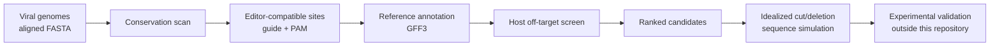

# ViralSafeTarget

**A reproducible, virus-first research toolkit for conserved genome target prioritization, host off-target triage, and sequence-level disruption simulation.**

ViralSafeTarget is designed for computational researchers who want to start with a collection of viral genomes and produce an auditable table of candidate target sites. The first case study is HSV-2, but the core pipeline is intended to be reusable for other DNA viruses.

> **Scope:** this repository produces computational hypotheses. It does not prove editing, viral inactivation, safety, latency clearance, or clinical efficacy. It contains no wet-lab protocol.

## What the pipeline does



It answers questions such as:

- Is this target sequence present across many viral strains?
- Which annotated viral feature contains the target?
- Does a selected editor have a compatible PAM at that location?
- Are there similar host sites that require off-target review?
- If two idealized cuts occurred, which reference interval would be deleted?

It does **not** answer whether delivery succeeds, whether chromatin is accessible, how often a repair outcome occurs, whether the virus remains viable, or whether a treatment is safe.

## Quick start

### One researcher-facing workflow

For the complete HSV-2 computational reproduction plan:

```bash
vst reproduce hsv2
```

After reviewing external requirements, execute or resume it with:

```bash
vst reproduce hsv2 --execute
```

For a new virus, create a self-contained project instead of copying an HSV-specific
script:

```bash
vst project init \
  --id my-virus \
  --display-name "My virus" \
  --reference-accession REF_ACCESSION \
  --out-dir projects/my-virus

vst project validate --project projects/my-virus/project.yaml
vst project run --project projects/my-virus/project.yaml
vst project status --project projects/my-virus/project.yaml
```

See [`docs/REPRODUCIBILITY.md`](docs/REPRODUCIBILITY.md) and
[`docs/NEW_VIRUS_WORKFLOW.md`](docs/NEW_VIRUS_WORKFLOW.md). The scripts and notebooks
below remain as auditable case-study components; the `vst project` and
`vst reproduce` commands are the canonical entry points.

### Conda (recommended)

```bash
conda env create -f environment.yml
conda activate viral-safe-target
python -m pip install -e .
pytest -q
ruff check .
bash scripts/run_demo.sh
```

Open the generated files under `reports/demo/`.

### Local upload interface

```bash
streamlit run app.py
```

Upload an **already aligned** multi-FASTA and, optionally, a matching GFF3 annotation. The browser interface is intended for local research use.

### Jupyter

```bash
jupyter lab
```

For an English end-to-end workflow, open
`notebooks/08_RUN_FULL_PIPELINE_EN.ipynb`. The focused multi-tool tutorial is
`notebooks/07_HSV2_MULTITOOL_COMPARISON_EN.ipynb`, and the genome-wide discovery
tutorial is `notebooks/09_HSV2_GENOME_WIDE_DISCOVERY_EN.ipynb`.
The presentation walkthrough is
`notebooks/11_HSV2_RESEARCH_SHOWCASE_EN.ipynb`, and held-out population validation is
explained in `notebooks/12_HSV2_HELDOUT_POPULATION_VALIDATION_EN.ipynb`. Protein
mapping and predicted disruption are covered by
`notebooks/10_HSV2_GENE_FUNCTION_AND_DISRUPTION_EN.ipynb`, while the source-linked,
human-reviewed literature workflow is
`notebooks/13_EVIDENCE_AGENT_HUMAN_REVIEW_EN.ipynb`.

## Published computational result snapshots

Selected result tables and HTML reports from the completed HSV-2 runs are checked in
under [`reports/`](reports/README.md). The public snapshot includes the exhaustive
genome-wide targetability ranks, the balanced presentation analysis, and the
review-pending Evidence Agent output. Large host-hit tables, reference genomes,
raw Cas-OFFinder batches, and caches are intentionally excluded.

The exhaustive screen completed all 109 host-screen batches for 23,108 eligible
candidate coordinates. Its leading targetability genes are UL3, UL10, UL52, UL47,
and UL11. These are model-bounded sequence-targetability results, not claims of
essentiality, safety, efficacy, or therapeutic value.

## Run the HSV-2 pilot on public data

```bash
bash scripts/run_real_hsv2.sh --sample-size 25
```

This validates or downloads public NCBI records, resumes checksum-cached stages,
selects a deterministic pilot sample, aligns it with MAFFT, and produces explainable
pre-human rankings plus corrected pair hypotheses.

To also download GRCh38 and prepare a Cas-OFFinder input file:

```bash
bash scripts/run_real_hsv2.sh --with-human --sample-size 25
```

The human genome is intentionally not committed to Git.

For the focused UL19/UL30 workflow, including deterministic Cas-OFFinder selection:

```bash
bash scripts/run_hsv2_pilot.sh
```

See [`docs/HSV2_PILOT.md`](docs/HSV2_PILOT.md) for the two-stage off-target run.

## Run the v0.4 multi-tool consensus

The consensus pilot reuses the completed v0.3 outputs and selects only the 32 candidates with no
predicted human hit within the configured Cas-OFFinder model and three-mismatch threshold:

```bash
bash scripts/run_hsv2_consensus.sh
```

It generates CRISPRitz inputs, imports researcher-supplied CRISPOR/CHOPCHOP/GuideScan2 exports when
present, preserves missing stages, and writes `reports/hsv2_consensus/report.html`. See
[`docs/HSV2_CONSENSUS_PILOT.md`](docs/HSV2_CONSENSUS_PILOT.md),
[`docs/PYTHON_SDK.md`](docs/PYTHON_SDK.md), and
[`docs/INTEGRATIONS.md`](docs/INTEGRATIONS.md).

Run the complete workflow from Jupyter with:

```bash
jupyter lab notebooks/08_RUN_FULL_PIPELINE_EN.ipynb
```

## Run HSV-2 genome-wide discovery

The balanced v0.5 workflow gives every annotated gene with an eligible candidate a
pre-human quota, adds the global leaders, and runs or resumes checksum-validated
Cas-OFFinder batches:

```bash
bash scripts/run_hsv2_genome_wide.sh
```

To regenerate a partial report without running external tools:

```bash
vst discover genome-wide --virus hsv2 --analysis-only
```

See [`docs/GENOME_WIDE_DISCOVERY.md`](docs/GENOME_WIDE_DISCOVERY.md). A missing batch is
never interpreted as a zero-hit result.

## Analyze gene function and predicted disruption

After a completed genome-wide run, map the top candidates to coding and protein
coordinates, import domain and disorder annotations, summarize alignment-bound
conservation, and generate size-defined indel and paired-deletion hypotheses:

```bash
vst analyze gene-function --out-dir reports/hsv2_gene_function
```

The analysis keeps sequence targetability, cited essentiality evidence, predicted
protein disruption, and evidence coverage separate. HSV-1 ortholog evidence is never
presented as direct HSV-2 evidence, and missing essentiality evidence remains unknown.
See `notebooks/10_HSV2_GENE_FUNCTION_AND_DISRUPTION_EN.ipynb`.

## Validate against an independent viral population panel

The population workflow excludes every discovery accession, audits all valid DNA
IUPAC ambiguity codes, and uses a locus-specific denominator for partial public
records. Install the optional reference mapper and run:

```bash
python -m pip install -e '.[population]'
vst analyze population \
  --population-fasta reports/hsv2_population_heldout/population_unique.fasta \
  --reference-fasta data/raw/hsv2_reference/ncbi_dataset/data/genomic.fna \
  --candidates reports/hsv2_genome_wide/genome_wide_candidates_post_human.csv \
  --out-dir reports/hsv2_population_report_balanced
```

Held-out exact sequence/PAM support is reported separately and never added to the
targetability, essentiality, or predicted-disruption scores. An absent target in a
partial record remains unknown unless a high-quality reference alignment covers that
locus.

For a checksum-audited NCBI download plus the complete validation/report workflow, run
`bash scripts/run_hsv2_population_validation.sh`. Existing downloads are reused.

## Build the presentation-ready HSV-2 case study

ViralSafeTarget now uses versioned virus, host and nuclease profiles instead of
hard-coding HSV-specific biology in the Python workflow. Validate the profiles and
build the multi-objective showcase with:

```bash
bash scripts/build_hsv2_showcase.sh
```

The report keeps sequence targetability, direct essentiality evidence, predicted
protein disruption and evidence coverage separate. It produces a balanced deep
panel, computational comparison sets, figures, findings, methods, limitations and
an auditable run manifest under `reports/hsv2_showcase/`. The generated
`research_findings.csv` keeps each potentially useful observation or hypothesis
beside its computational support and the limitation that prevents overclaiming.

See [`docs/GENERIC_PROFILES.md`](docs/GENERIC_PROFILES.md) and
[`docs/PRESENTATION_WORKFLOW.md`](docs/PRESENTATION_WORKFLOW.md).

## Main outputs

- `candidates_ranked_pre_human.csv`: retained candidates with visible score components.
- `candidates_rejected_pre_human.csv`: rejected candidates and explicit reasons.
- `candidates_ranked_post_human.csv`: separate post-human score when results exist.
- `predicted_human_hits.csv`: parsed predicted hits when results exist.
- `pair_hypotheses_same_gene.csv`: bounded same-gene deletion hypotheses.
- `pair_hypotheses_multi_target.csv`: independent cross-gene target hypotheses.
- `report.html`: human-readable summary.
- `run_manifest.json`: input checksums, parameters, environment and Git commit.

## What “simulation” means here

The included simulator calculates canonical SpCas9 cut coordinates and the sequence interval that would be removed **if** two selected cuts occurred. It can report overlap with annotated features and exact pair coverage across the input viral alignment.

This is a sequence transformation, not a cell or organism simulator. To measure real editing, researchers need sequencing data and tools such as CRISPResso2. To evaluate potential host off-target sites at genome scale, use a validated engine such as Cas-OFFinder or CRISPRitz. To establish viral inactivation, appropriate virology experiments are required.

See [`docs/SIMULATION_LIMITS.md`](docs/SIMULATION_LIMITS.md) and [`docs/KNOWN_LIMITATIONS.md`](docs/KNOWN_LIMITATIONS.md).

## Curated evidence

The schema is `data/curated/viral_gene_evidence.schema.csv`. Add only source-linked,
reviewed rows to a virus-specific table and pass it with `--gene-evidence`. Supported
status vocabulary includes `supported`, `suggested`, `unknown`, and `conflicting`.
Unknown or missing evidence remains missing and never silently receives a positive
score. See [`docs/OUTPUT_INTERPRETATION.md`](docs/OUTPUT_INTERPRETATION.md).

### Evidence Agent (human review required)

`vst evidence discover --project project.yaml` builds an alias-aware gene catalog,
queries PubMed, Europe PMC, UniProt and NCBI reference metadata, and writes a linked
`review_queue.tsv`. Every discovered row is `pending` and has no effect on scoring.
After source review, `vst evidence apply --project project.yaml` exports only rows
explicitly marked `approved`; reviewer identity, review date and source URL are required.
Direct target-virus evidence and ortholog evidence remain separate. See
[`docs/EVIDENCE_AGENT.md`](docs/EVIDENCE_AGENT.md).

## Repository structure

```text
ViralSafeTarget/
├── app.py                    # local upload UI
├── configs/                  # example research configurations
├── data/demo/                # synthetic smoke-test data
├── data/knowledge/           # evidence templates, not biological truth tables
├── docs/                     # concepts, formats, validation and tool map
├── notebooks/                # guided research notebooks
├── scripts/                  # demo and real-data workflows
├── schemas/                  # generic profile and evidence contracts
├── src/viral_safe_target/    # reusable Python package
├── tests/                    # unit tests
└── .github/                  # CI and contribution templates
```

## Research contribution target

A useful paper would not claim “we found a cure” from computational scores. A credible contribution would demonstrate that ViralSafeTarget:

1. recovers published viral targets without using them to tune the result;
2. improves strain coverage or host-specificity over existing baselines;
3. produces reproducible decisions with explicit rejection reasons;
4. generalizes to held-out viruses or newly published genomes; and
5. ideally prioritizes candidates later validated by an independent laboratory.

## Existing tools we complement

ViralSafeTarget is an orchestration and provenance layer, not a replacement for mature tools:

- MAFFT — multiple sequence alignment
- Cas-OFFinder — genome-scale off-target enumeration
- CRISPRitz — variant-aware off-target analysis
- GuideScan2 / CRISPOR / CHOPCHOP — guide design and specificity scoring
- CRISPResso2 — analysis of measured genome-editing sequencing data

See [`docs/EXISTING_TOOLS.md`](docs/EXISTING_TOOLS.md).

## Safety and responsible use

Read [`DISCLAIMER.md`](DISCLAIMER.md) and [`SECURITY.md`](SECURITY.md). The project is for legitimate computational research and education. Do not interpret rankings as treatment recommendations or use them as a substitute for institutional biosafety, ethics, clinical, or regulatory review.

## Citation

Use [`CITATION.cff`](CITATION.cff). Before public release, replace the placeholder repository owner and author metadata.

## License

MIT.
