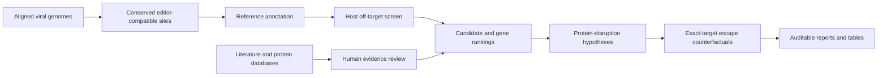

# ViralSafeTarget

**A virus-first computational research toolkit for conserved target discovery,
host off-target triage, virtual-knockout sequence hypotheses, exact-target escape
robustness, and source-linked evidence review.**

[Hebrew overview](README_HE.md) · [Documentation](docs/README.md) ·
[Completed result snapshots](reports/README.md) · [Notebooks](notebooks/README.md)

> ViralSafeTarget produces computational hypotheses. It does not establish editing,
> safety, viral inhibition, latency clearance, treatment efficacy, or a cure. It does
> not provide wet-lab protocols.

## Choose your path

| Goal | Start here |
|---|---|
| Inspect the completed HSV-2 results | [`reports/README.md`](reports/README.md) |
| Inspect virtual knockout and escape results | [`reports/hsv2_virtual_knockout_escape/FINDINGS.md`](reports/hsv2_virtual_knockout_escape/FINDINGS.md) |
| Learn the workflow in Hebrew | [`notebooks/00_START_HERE.ipynb`](notebooks/00_START_HERE.ipynb) |
| Run a small synthetic example | `make demo` |
| Reproduce the HSV-2 case study | `vst reproduce hsv2` |
| Analyze a new virus | `vst project init ...` |
| Discover literature evidence | `vst evidence discover ...` |
| Understand the architecture | [`docs/reference/ARCHITECTURE.md`](docs/reference/ARCHITECTURE.md) |

The `vst` command is the canonical researcher interface. Files under `scripts/` are
auditable case-study launchers and maintenance helpers; they are catalogued in
[`scripts/README.md`](scripts/README.md).

## Install and verify

```bash
conda env create -f environment.yml
conda activate viral-safe-target
python -m pip install -e .
pytest -q
ruff check .
```

Useful shortcuts:

```bash
make demo          # synthetic end-to-end smoke test
make notebook      # start JupyterLab
make ui            # start the local Streamlit interface
make reproduce-hsv2
```

## Core workflow



The pipeline keeps four questions separate:

1. **Sequence targetability:** is the site conserved, unique, editor-compatible, and
   acceptable under the declared host-search model?
2. **Biological evidence:** what experiments support a function or essentiality claim,
   in which virus and model?
3. **Predicted disruption:** where does the site map in the coding sequence and what
   idealized sequence outcomes could affect?
4. **Evidence coverage:** what is known, transferred from an ortholog, unresolved, or
   missing?
5. **Escape robustness:** how well is an exact target supported in observed viral
   populations, and how many distinct substitutions are required to remove every exact
   target in a configured multiplex panel?

Missing evidence remains unknown. A zero predicted host hit is model-bounded and is
not proof of safety.

## Analyze a new virus

Create a self-contained project instead of copying HSV-specific code:

```bash
vst project init \
  --id my-virus \
  --display-name "My virus" \
  --reference-accession REF_ACCESSION \
  --out-dir projects/my-virus

vst project validate --project projects/my-virus/project.yaml
vst project run --project projects/my-virus/project.yaml
vst project status --project projects/my-virus/project.yaml
```

The default project workflow now writes bounded virtual-knockout and exact-target
escape outputs after pair analysis. The same analyses can be run directly:

```bash
vst analyze virtual-knockout --project projects/my-virus/project.yaml
vst analyze escape --project projects/my-virus/project.yaml
vst analyze multiplex --project projects/my-virus/project.yaml
```

The indel grid is not a repair-frequency model, and the multiplex barrier is not an
evolutionary probability. See
[`docs/workflows/VIRTUAL_KNOCKOUT_ESCAPE.md`](docs/workflows/VIRTUAL_KNOCKOUT_ESCAPE.md).

Inputs and profiles are documented in
[`docs/getting-started/NEW_VIRUS_WORKFLOW.md`](docs/getting-started/NEW_VIRUS_WORKFLOW.md).
The project command records stage state, configuration, checksums, missing external
tools, and report provenance.

## Reproduce the HSV-2 case study

Preview the plan without downloading or changing data:

```bash
vst reproduce hsv2
```

Execute or resume the versioned workflow:

```bash
vst reproduce hsv2 --execute
```

The public snapshots include a balanced presentation analysis and the later exhaustive
host screen. They are labeled separately because their sampling depths differ. See
[`reports/README.md`](reports/README.md) before comparing ranks.

Current exhaustive snapshot:

- 23,108 eligible candidate coordinates and 21,654 unique guide sequences;
- 109/109 Cas-OFFinder batches completed against GRCh38.p14;
- 2,668 candidate-coordinate rows with no predicted hit under the declared model;
- leading computational targetability genes: UL3, UL10, UL52, UL47, and UL11.

These are targetability results, not biological or therapeutic rankings.

The publication-facing virtual analysis snapshot covers the current 257-guide deep
panel. It preserves 271 guide-to-CDS mappings for overlapping annotations, enumerates
5,691 bounded indel hypotheses and 17,733 single-nucleotide counterfactuals, and
compares four configured multiplex strategies without a combined therapeutic score.

## Evidence Agent

```bash
vst evidence discover --project projects/my-virus/project.yaml
```

The agent creates an alias-aware catalog, source queries, source-linked proposals, and
a `review_queue.tsv`. Every proposal starts as `pending`. A researcher must inspect the
source, virus species, experiment, model, excerpt, and interpretation.

```bash
vst evidence apply \
  --project projects/my-virus/project.yaml \
  --review-queue results/evidence/review_queue.tsv
```

Only explicitly approved rows with reviewer identity, review date, and source URL are
exported to the curated evidence table. Direct target-virus evidence and ortholog
evidence remain separate. See
[`docs/workflows/EVIDENCE_AGENT.md`](docs/workflows/EVIDENCE_AGENT.md).

## Repository map

```text
ViralSafeTarget/
├── src/viral_safe_target/   reusable Python package and CLI
├── configs/                 generic profiles and case-study configuration
├── schemas/                 machine-readable project/evidence contracts
├── data/demo/               tiny synthetic test inputs
├── data/curated/            reviewed, source-linked case-study inputs
├── notebooks/               guided learning and reproducibility notebooks
├── scripts/                 case-study launchers and internal helpers
├── docs/                    organized user, workflow, reference, and research docs
├── reports/                 selected public snapshots; large generated files ignored
├── tests/                   unit, integration, notebook, and structure checks
└── app.py                   optional local upload interface
```

Directory-specific indexes:

- [`docs/README.md`](docs/README.md)
- [`notebooks/README.md`](notebooks/README.md)
- [`scripts/README.md`](scripts/README.md)
- [`configs/README.md`](configs/README.md)
- [`schemas/README.md`](schemas/README.md)

## External tools and boundaries

ViralSafeTarget orchestrates and records results from mature tools; it does not replace
them. Supported workflows include MAFFT, Cas-OFFinder, CRISPRitz, and imports from
CRISPOR, CHOPCHOP, GuideScan2, and CRISPResso2. Missing external results remain pending
and never become favorable scores. See
[`docs/reference/EXISTING_TOOLS.md`](docs/reference/EXISTING_TOOLS.md) and
[`docs/reference/INTEGRATIONS.md`](docs/reference/INTEGRATIONS.md).

## Development

```bash
python -m pip install -e .[dev]
pytest -q
ruff check .
```

Contributions should preserve deterministic IDs, explicit missing values, source
provenance, direct-versus-ortholog evidence separation, and the non-clinical scope.
Read [`CONTRIBUTING.md`](CONTRIBUTING.md), [`SECURITY.md`](SECURITY.md), and
[`DISCLAIMER.md`](DISCLAIMER.md).

## Citation and license

Use [`CITATION.cff`](CITATION.cff). Licensed under the [MIT License](LICENSE).
